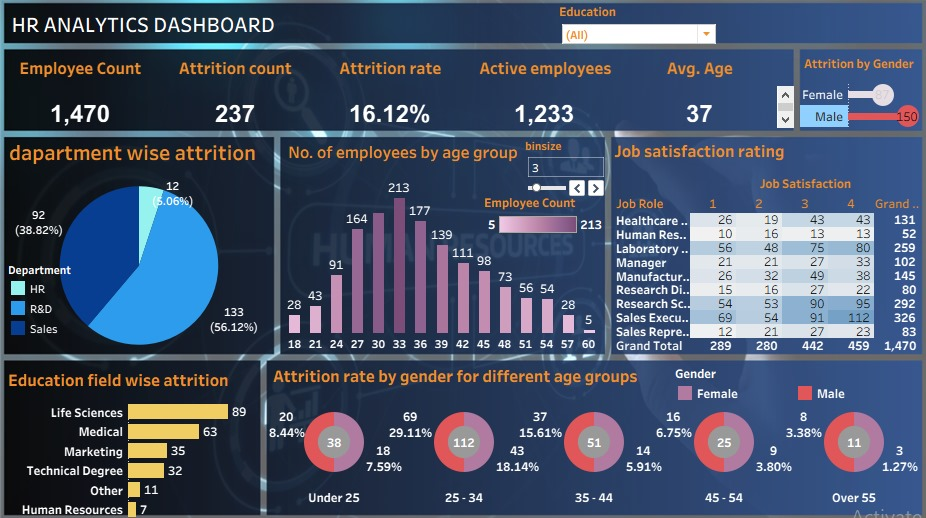

# DATA-ANALYSIS-DASHBOARD-USING-TABLEAU
Tableau-based HR Analytics project showcasing data visualization, KPI tracking, and attrition analysis to support HR decision-making.
# 📊 HR Analytics Dashboard (Tableau)

## 📘 Project Overview  
This project focuses on **HR Analytics**, providing data-driven insights into employee attrition, demographics, and job satisfaction.  
The interactive Tableau dashboard helps HR professionals and management understand the key factors influencing employee turnover and workforce distribution.  

By analyzing various dimensions such as **age, gender, department, education field, and job satisfaction**, this dashboard supports data-informed decision-making to improve employee retention and engagement.

---

## 🎯 Objectives  
- To analyze employee attrition patterns and identify high-risk segments.  
- To explore the relationship between **education, age group, and job role** with attrition.  
- To visualize key HR metrics such as **employee count, attrition rate, and satisfaction levels**.  
- To assist HR departments in developing better retention strategies.  

---

## 📂 Dataset Details  
The dataset used contains employee information including:  
- **Employee ID**  
- **Age, Gender, Department**  
- **Education Field, Job Role**  
- **Attrition (Yes/No)**  
- **Job Satisfaction Rating**  
- **Total Working Years, Monthly Income**, and other HR-related attributes  

**Total Records:** 1,470 employees  
**Source:** Sample HR dataset (commonly used for analytics and learning purposes)

---

## 🧠 Key Insights from Dashboard  
- **Total Employees:** 1,470  
- **Attrition Count:** 237  
- **Attrition Rate:** 16.12%  
- **Average Age:** 37 years  
- **Active Employees:** 1,233  

### 🔹 Department-Wise Attrition  
- **Sales Department** shows the highest attrition (56.12%)  
- **R&D Department** follows with 38.82%  

### 🔹 Education Field-Wise Attrition  
- Employees with **Life Sciences** and **Medical** backgrounds show higher attrition.  

### 🔹 Gender & Age Group Insights  
- Male attrition (150) is significantly higher than female attrition (87).  
- The **25–34 age group** shows the highest attrition rate (29.11%).  

### 🔹 Job Satisfaction  
- Job satisfaction is relatively balanced across roles, but **Sales Executives** have a larger workforce with mixed satisfaction levels.  

---

## 🧰 Tools and Technologies Used  
- **Tool:**  Tableau Public  
- **Data Source:** Excel dataset  
- **Techniques Used:**  
  - Data cleaning & transformation in Tableau  
  - Interactive filters (Education, Gender)  
  - Use of parameters and bins for age grouping  
  - Pie, bar, and donut charts for visual clarity  
  - Dashboard design and layout optimization  

---

## 📈 Dashboard Features  
✅ Interactive filters for **Education Field** and **Gender**  
✅ KPI cards showing key metrics (Attrition Rate, Active Employees, Avg. Age)  
✅ Visuals for **department, education field, and age group attrition**  
✅ Job satisfaction matrix by job role  
✅ Clean, modern layout with consistent color palette  

---

## 💡 Business Impact  
This dashboard helps organizations:  
- Identify critical attrition areas  
- Improve retention strategies  
- Enhance hiring and employee engagement processes  
- Monitor HR performance and workforce demographics effectively  

---

## 📸 Dashboard Preview  

---

## 🚀 How to Use  
1. Download the `.twbx` or `.twb` Tableau file from this repository.  
2. Open it in **Tableau Desktop** or **Tableau Public**.  
3. Interact with filters (Education, Gender) to explore insights dynamically.  

---

## 🧾 Conclusion  
The HR Analytics Dashboard transforms raw employee data into meaningful insights that support strategic HR decisions.  
It provides a clear visual understanding of attrition trends, satisfaction levels, and workforce structure — helping organizations retain top talent and improve workplace satisfaction.  

---

## 👩‍💻 About me  
**Neha Sharma**  
*MCA (Data Science) *  
📫 [sharmaneha3720@gmail.com]  

---

